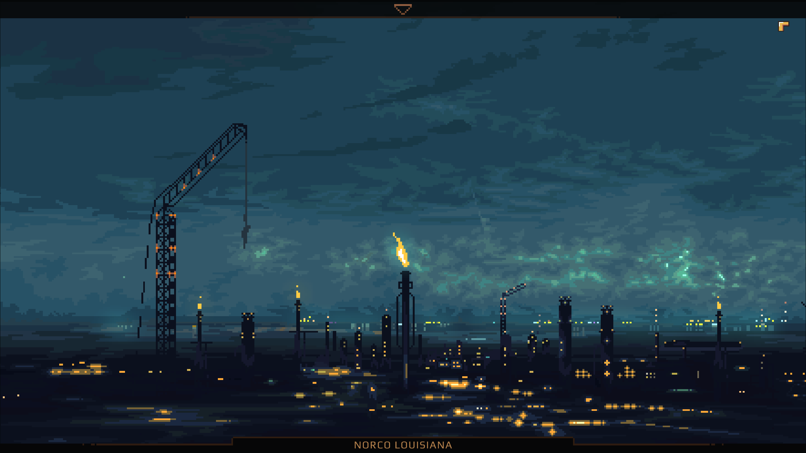
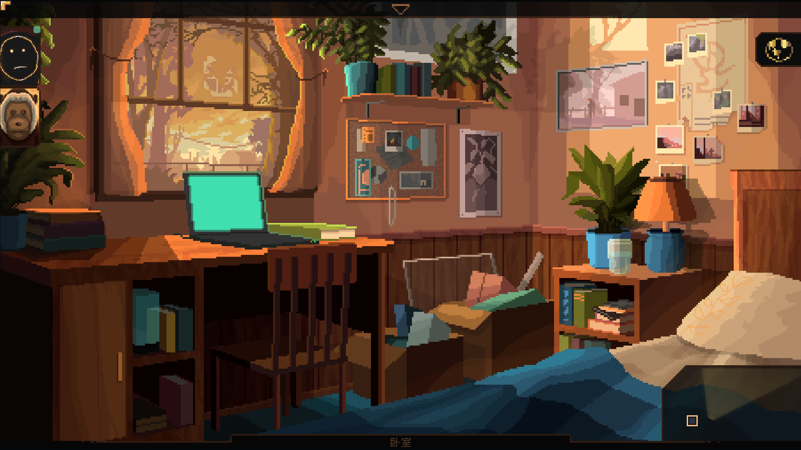
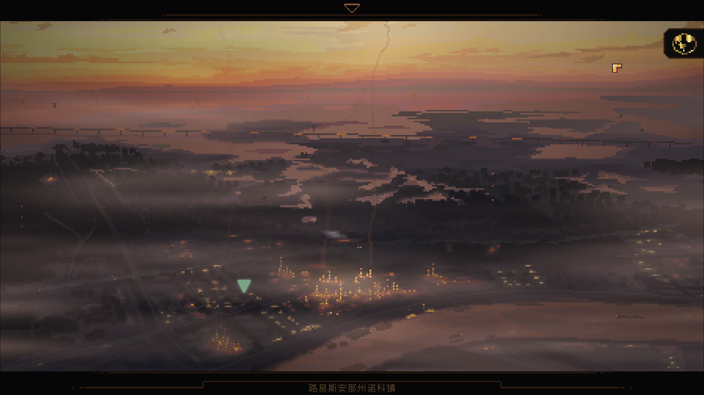
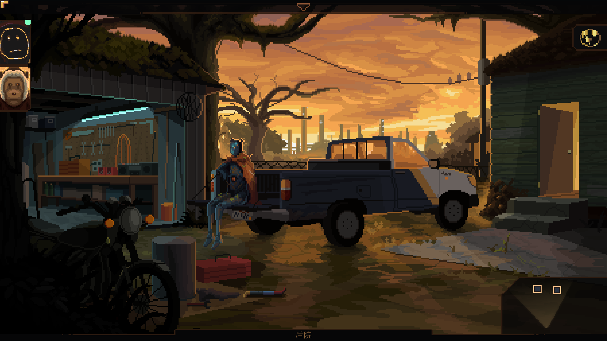
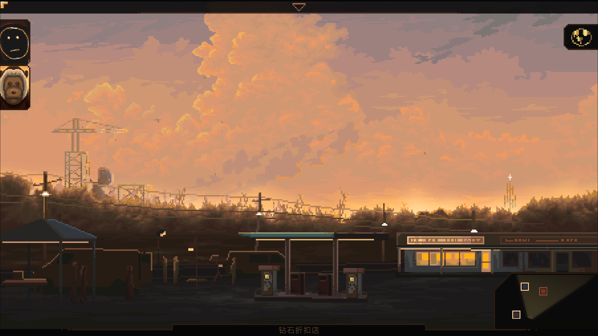
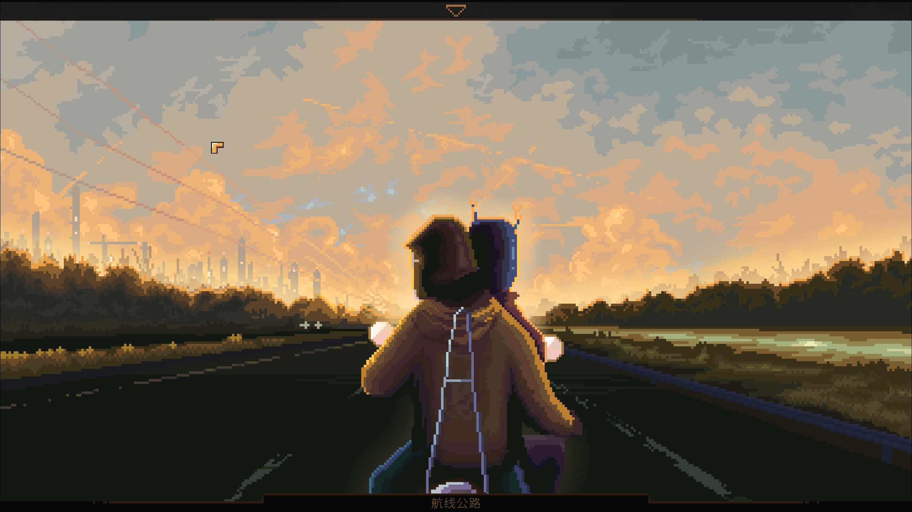

*Shield hid the stars behind halogen and flame projected onto the sky every night. The refinery exhaled an endless sigh. I still can't 'sleep without that noise.*

## 序章

​	序章讲述了我（女主）多年前因为与家庭的不合，不顾**弟弟Blake**的劝阻的离家出走，乘坐火车浪迹于美国西部。浸润在郊区的光污染中，我接到了Blake的电话，然而青春期的我并没有读懂布雷克口中“*妈妈的健康每况愈下*”到底有多“糟糕”，反倒参加了流亡者民兵，并度过了接下来几年的时光。直到在血肉飞溅的战场上，蜷缩在战壕里，我才拨打了家里的电话，得知母亲已经离世。自出走，历经五年，我终于回到了路易斯安那的家中。

## 低地幽灵

​	我回到了充满旧日气息的家里，醒来便已是黄昏。一把发现了角落里积灰的*猴子*，这是我曾经的玩伴。玩偶就是这样，即使被遗弃多年，我只要轻轻抱抱，它的怒气就如雪般消融。可是猴子的眼里却是无尽的疲惫，望穿我的身体。桌上的电脑还亮着，布雷克似乎在看论坛上关于**嘎嘎快跑App*的讨论

​	回想路易斯安娜，炼油厂的高塔耸立，带来了无穷无尽的噪音与污染，输油管道如同血管般四通八达，奔涌不停，震颤着密西西比河岸松软肥沃的土地。

​	灾难从未放弃路易斯安娜，我家的房子被水淹了三次，第一次我太小了，只记得妈妈和外公在皮卡上叫卖玩偶，我被玩偶们挤得难以落脚；第二次是水泵站坏掉，我和妈妈，布雷克住了两个星期酒店，妈妈每天都要干活翻修房子；第三次也是水泵站的问题，我怨她没有早点搬家，便去新奥尔良州和同学住了。

​	第四次水灾，会毁了这个小镇，炼油厂也被破坏殆尽，政府不管不顾，我们的家园沦为海盗与雇佣兵的前线堡垒。

​	离开卧室来到客厅，相册勾起了模糊的记忆，关于**妈妈凯瑟琳**，布雷克，“若有若无”的父亲布鲁，童年时去世的外公，以及一个面部被抹除的男人。书架上的一本书，讲述了一个小镇居民不是因为炼油厂的污染，而是因为受不了被媒体当作受害者，接受没完的采访与直播，搬离了小镇。

​	厨房里，妈妈的止痛药在桌子上撒了一篇，满是蟑螂的微波炉让我心有余悸。

​	来到后院，米利恩正静静地坐在皮卡上，她是妈妈捡回来的，我和布雷克捣鼓了一天root，把她修好。时间也在她身上留下了和环境一样的锈迹。透过米利恩，我们知道布雷克在母亲的最后时刻对她尽心尽力地照顾，只是现在不知道去哪里了；以及母亲生前似乎在受人委托研究这座小镇的历史。

​	我前往加油站，去买米利恩拜托我的保险丝。河边，我遇到了一个片组。记性不好的导演拉住我，要我教“洛杉矶来的”演员一些民俗知识，只是他似乎对这里抱有神秘主义的期待，在我说骂人只是用平平无奇的“混球”后便扫兴地让我滚蛋了。

​	在加油站外面，特洛伊拦住了我，他曾经是便利店的收银员，后来公司弄了个AI收银员取代了他，他和妈妈有点交情，不过讨厌我。在把厨房桌上的止痛药给他后，他便放我们进便利店了。便利店里面的狗粮、香烟货架满满当当，井井有条，口香糖、太妃糖似乎才是大多数人真正的目的。

​	修了摩托，凯瑟琳带着我去书店，想看看布雷克在不在那里。路上她说布雷克很在乎我的离开，后来辍学，时不时带点毒品到不知何处。母亲则表面上没有那么在意我的离开，说年轻人游历美国不是坏事。她还提到，母亲为了搜证盾牌在非法扩张，去湖边寻找线索，看到了*“某种东西”*。

