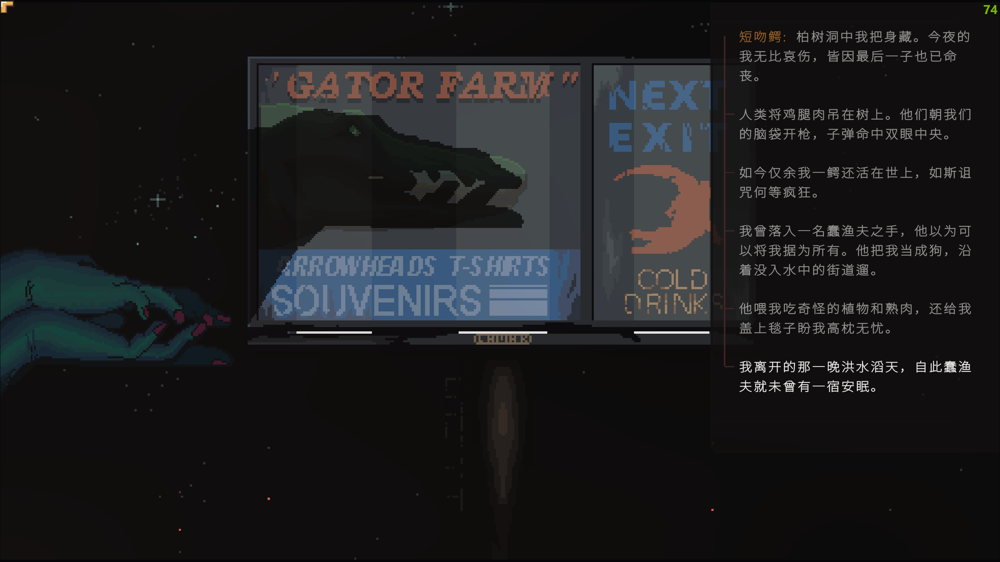

## 酒吧
    路易斯安那的秋，天高气爽，云像宝石一样折射出无数种不一样的颜色，但与之相衬的却是挣扎在生存线上的人们，米利恩载我到萨皮书店。从这里的人口中，我得知母亲生前的最后时光总是忧心忡忡的，甚至还会深夜在公路旁挖东西。

## 母亲
    从母亲在诊所备份的回忆中，得知她和布鲁结婚只是为了有家可归，后来她对布鲁坦白自己根本不爱他，也没爱过任何人，再之后不久，布鲁死于炼油厂的大爆炸。母亲的手机中，还保留着我和她的聊天，她对我关心不断，祈求我回来，就算打个电话也好，而我只敷衍连连。

